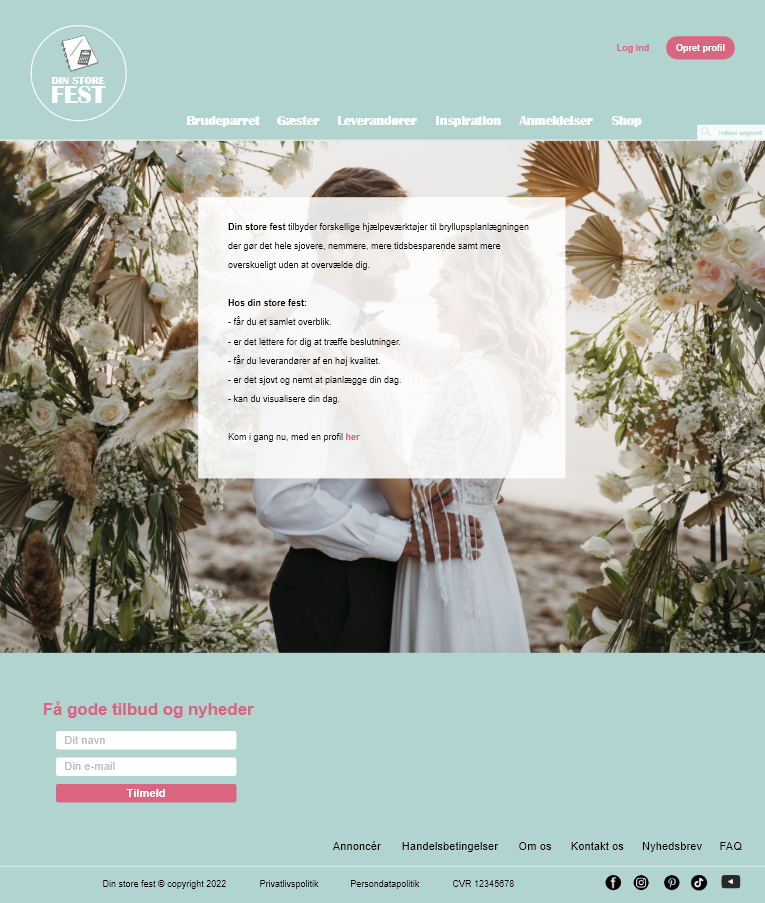

# Hovedopgave - Din store fest hovedopgave

Dette er det afsluttende projekt på datamatikeruddannelsen. Vi har valgt at lave et projekt med fokus på mockup og hertil kode en lille del/MVP. Vi har valgt at kode hjemmesidens forside samt menupunkter og log ind funktionen.

Projektet startes ved at skrive "npm start" i terminalen, herefter vil du få beskeden "Server is running on 4400". Gå til [localhost:4400](http://localhost:4400/) og du kan her se siden.

